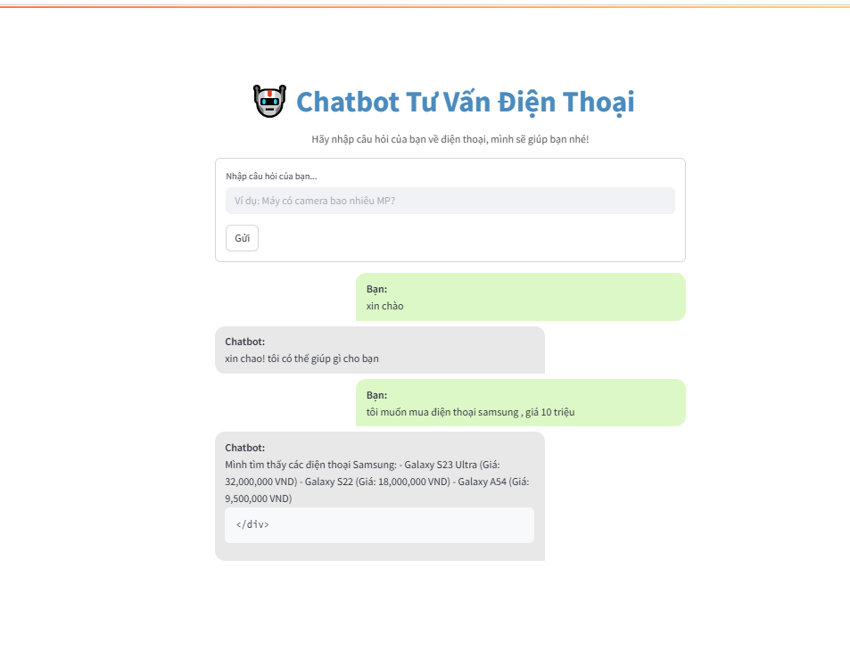
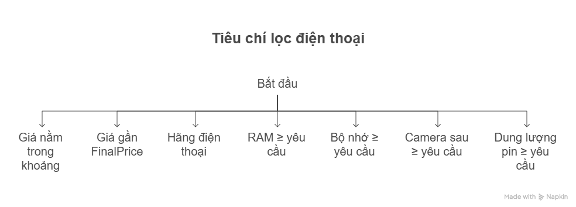
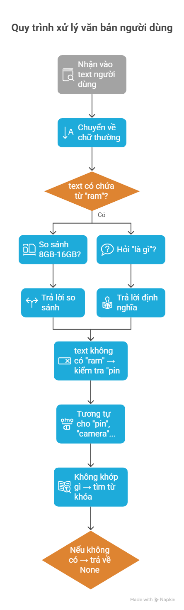
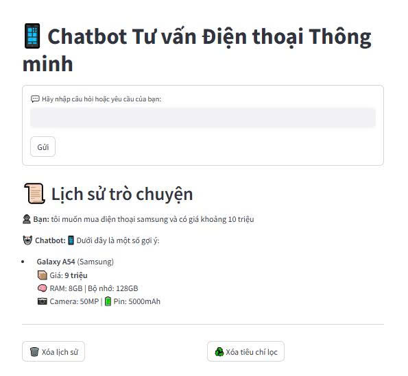
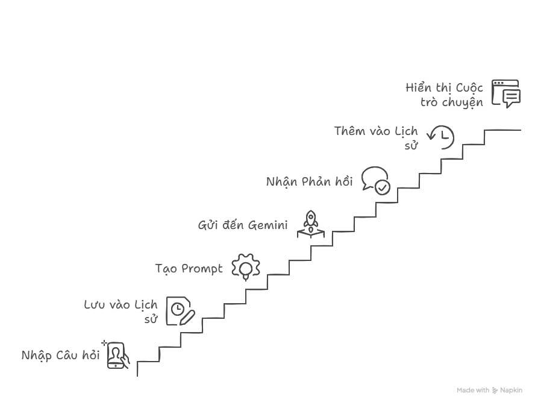
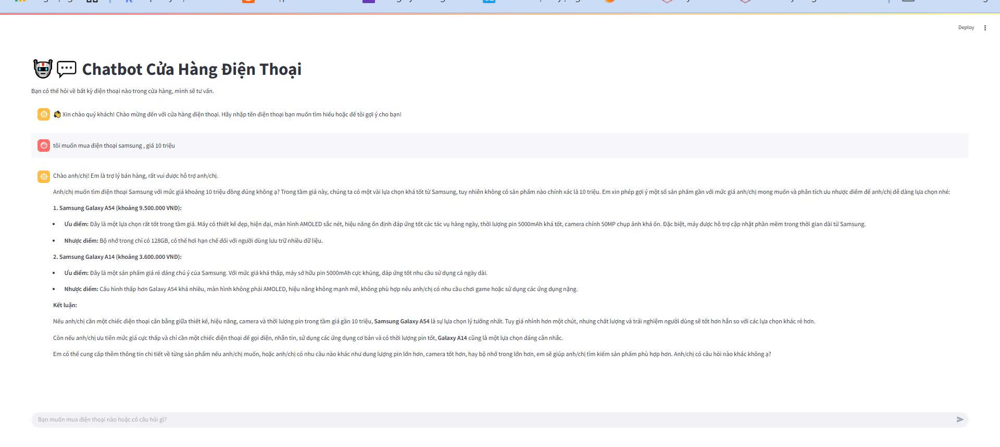

# 🤖 Chatbot Tư Vấn Điện Thoại  --- Mô hình machien learning

Chatbot hỗ trợ người dùng tìm kiếm và nhận tư vấn về điện thoại thông minh. Ứng dụng được xây dựng bằng **Python**, **Streamlit** và tích hợp mô hình **Machine Learning** để nhận diện và phân loại ý định người dùng từ văn bản tự nhiên.

🚀 Tính năng chính :

- 🧠 Dự đoán ý định người dùng bằng mô hình học máy (intent classifier)

- 📱 Gợi ý điện thoại theo hãng: Samsung, Apple, Xiaomi, Oppo, Vivo,...

- 💬 Giao diện trò chuyện thân thiện, dễ dùng

- 🔍 Nhớ ngữ cảnh câu hỏi trước đó để phân tích tốt hơn
# cấu trúc  thư mu
## 📁 Chi tiết các file chính

| File / Thư mục | Vai trò |
|----------------|--------|
| `App_model_ML.py` | Chạy giao diện chính, xử lý hội thoại, gọi Gemini/luật |
| `data/` | Chứa dữ liệu đầu vào: sản phẩm, mô hình máy học, phản hồi |
| `dienthoai_renamed (1).csv` | Dữ liệu về điện thoại (giá, RAM, pin, camera, hãng,...) |
| `intent_classifier.pkl` | Mô hình ML để phân loại câu hỏi người dùng (ý định) |
| `tfidf_vectorizer.pkl` | Vector hóa câu hỏi để mô hình có thể hiểu |
| `intent_answers.json` | Các câu trả lời tương ứng với từng loại ý định |
| `modules/model_loader.py` | Nạp các mô hình ML, vectorizer, dữ liệu JSON |
| `modules/chatbot_logic.py` | Phân tích câu hỏi → phân loại → trả lời hoặc gọi Gemini |
| `modules/ui_components.py` | Hàm hiển thị tin nhắn, thẻ sản phẩm, đoạn hội thoại |
| `README.md` | Hướng dẫn cài đặt, sử dụng, phát triển tiếp chatbot |

📊 Dữ liệu điện thoại từ file CSV có thông tin sản phẩm và giá
---
##  Xây dựng dữ liêu : 
 - train_data.py : một script Python dùng để sinh dữ liệu huấn luyện (training data)
cho mô hình học máy phân loại ý định (intent classification) 
 - Mục đích:
     - Sinh ra dữ liệu huấn luyện gồm các câu hỏi mẫu kèm nhãn intent và câu trả lời mẫu.

     - Dữ liệu này giúp mô hình học máy phân loại ý định (intent classification) trong chatbot tư vấn điện thoại.

     - Mục tiêu là chatbot có thể hiểu và trả lời đúng các loại câu hỏi phổ biến của người dùng.
   ==> tạo file data : `inten_data.csv`
    Quy trình tạo file:
     1. Định nghĩa intent với:

       - Các câu hỏi dạng template có chứa biến.

       - Các câu hỏi cụ thể (phrases) cho một số intent.

       - Câu trả lời mẫu tương ứng cho từng intent.

     2. Sinh câu hỏi từ template:

       - Thay thế biến trong template bằng tất cả giá trị có thể.

       - Kết hợp tạo ra nhiều câu hỏi đa dạng cho mỗi intent.

     3. Nhân bản câu cụ thể (phrases) để tăng số lượng mẫu.

       - Xáo trộn toàn bộ câu hỏi và giới hạn số lượng dữ liệu (2000 dòng).

       - Ghi dữ liệu vào file CSV với các cột: text (câu hỏi), label (intent), answer (câu trả lời mẫu).
 - data_answer.py : 
    Mục đích:

       - Tạo file JSON chứa bản đồ giữa mỗi intent (nhãn) với câu trả lời mẫu tương ứng.
       - Giúp chatbot dễ dàng tra cứu và trả lời theo intent đã được phân loại từ mô hình học máy.
    Quy trình tạo file:
     1. Đọc dữ liệu huấn luyện từ file CSV (intent_data.csv) có 3 cột chính:

        - text: câu hỏi mẫu

        - label: nhãn intent của câu hỏi

        - answer: câu trả lời mẫu tương ứng

     2. Tạo dictionary với key là label (intent) và value là câu trả lời mẫu (answer).

        - Nếu nhiều dòng cùng intent, chỉ lấy câu trả lời đầu tiên không rỗng.

        - Nếu câu trả lời rỗng hoặc không có, gán giá trị rỗng.

     3. Ghi dictionary ra file JSON (`intent_answers.json`) để sử dụng trong chatbot khi trả lời câu hỏi.


## 🧠 Mô Hình Học Máy

### 1. Mục tiêu

Sử dụng mô hình học máy để **phân loại ý định (intent)** của người dùng dựa trên câu hỏi họ nhập vào.

Các loại intent tiêu biểu:
- `brand_question`: Hỏi về hãng điện thoại (ví dụ: "Có điện thoại Samsung không?")
- `price_question`: Hỏi về mức giá (ví dụ: "Máy tầm 10 triệu có không?")
- `camera_question`: Hỏi về camera (ví dụ: "Camera bao nhiêu MP?")
- `greeting`, `thanks`, `goodbye`: Chào hỏi, cảm ơn, tạm biệt

---

### 3. Các Tệp Liên Quan
| Tên Tệp                 | Vai Trò                                                                |
| ----------------------- | ---------------------------------------------------------------------- |
| `intent_classifier.pkl` | Mô hình học máy đã huấn luyện để phân loại ý định người dùng (intent). |
| `tfidf_vectorizer.pkl`  | Bộ biến đổi TF-IDF để chuyển văn bản đầu vào thành vector số.          |
| `intent_answers.json`   | Danh sách các câu trả lời mẫu tương ứng với từng intent đã định nghĩa. |

### 2. Pipeline Học Máy

Mô hình được huấn luyện theo pipeline:


TfidfVectorizer + LogisticRegression

trong dó : 
   - ` TF-IDF Vectorizer`: Chuyển đổi văn bản sang vector đặc trưng dạng số.
   - `Logistic Regression` : Mô hình phân loại tuyến tính dùng để dự đoán intent.
 Giải thích code chi tiết : 
   
---
📊 Sơ Đồ Hoạt Động Hệ Thống Chatbot
Hệ thống chatbot tư vấn điện thoại hoạt động theo các bước chính như sau:

1. Nhận đầu vào từ người dùng
Người dùng nhập câu hỏi hoặc yêu cầu về điện thoại thông minh qua giao diện Streamlit.

2. Tiền xử lý văn bản
Câu hỏi được tiền xử lý và chuyển thành vector đặc trưng bằng mô hình TF-IDF Vectorizer, để số hóa dữ liệu văn bản.

3. Dự đoán intent (ý định)
Vector đặc trưng được đưa vào mô hình Logistic Regression để phân loại ý định của người dùng (ví dụ: hỏi về hãng điện thoại, giá cả, thông số camera...).

4. Xử lý logic trả lời

- Nếu intent thuộc nhóm hỏi về hãng điện thoại (brand_question), hệ thống lọc dữ liệu điện thoại trong kho dựa trên hãng được nhắc đến và trả về danh sách sản phẩm phù hợp.

- Nếu intent có câu trả lời cố định trong file intent_answers.json, hệ thống lấy câu trả lời tương ứng.

- Nếu không xác định được intent hoặc câu trả lời, chatbot sẽ trả lời mặc định yêu cầu người dùng hỏi lại rõ hơn.

5. Hiển thị câu trả lời cho người dùng
Phản hồi được gửi lại và hiển thị trên giao diện chat thân thiện, hỗ trợ lịch sử đối thoại.

6. Lưu trạng thái đối thoại
Hệ thống lưu lại lịch sử câu hỏi, intent và câu trả lời để hỗ trợ các câu hỏi tiếp theo, nhất là khi câu hỏi ngắn hoặc phụ thuộc ngữ cảnh trước đó.
### Sơ đồ hoạt động : 


--- 
## Giải thích code : 
 - Train_model.py : 
--- 
## Giao diện ứng dụng :  
 

---
## cách chạy ứng dụng 
- `streamlit run App_model_ML.py`
- -------
# 🤖 Chatbot Tư Vấn Điện Thoại  --- Luật và regex ( hệ chuyen gia )
## cấu trúc thư mục và giải thích: 
---
 - sử dụng data :  `data/dienthoai_renamed (1).csv`
 📄 app.py — File chính chạy giao diện và điều phối logic
**Mục đích**: Giao diện ứng dụng Streamlit, xử lý nhập liệu người dùng, điều phối các hàm xử lý ở các file khác.

**Tác dụng**:

* Hiển thị giao diện web với tiêu đề, ô nhập liệu, nút gửi.
* Lưu và hiển thị lịch sử hội thoại (`chat_history`) và thông tin lọc (`thong_tin_tich_luy`).
* Gọi các module:

  * `extractor.py` để phân tích yêu cầu người dùng.
  * `knowledge.py` để trả lời kiến thức.
  * `filter.py` để gợi ý sản phẩm phù hợp.

📁 data/ — Thư mục chứa dữ liệu
📄 dienthoai\_renamed (1).csv
**Mục đích**: Chứa danh sách điện thoại cùng các thuộc tính như giá, RAM, camera...

**Tác dụng**:

* Cung cấp dữ liệu đầu vào để chatbot tìm và gợi ý sản phẩm phù hợp yêu cầu người dùng.
* Dữ liệu được nạp vào `app.py` để sử dụng trong các hàm lọc (`filter.py`).

📁 utils/ — Thư mục chứa các hàm xử lý logic (giống như "não" của chatbot)

📄 extractor.py — Trích xuất yêu cầu người dùng
**Mục đích**: Xử lý ngôn ngữ tự nhiên để tìm ra thông tin như: hãng, RAM, giá, pin...

**Tác dụng**:

* Phân tích câu như "Tôi muốn mua điện thoại Samsung tầm 10 triệu" để ra:

```python
{"Brand": ["Samsung"], "FinalPrice": 10_000_000}
```

📄 knowledge.py — Trả lời kiến thức cấu hình điện thoại
**Mục đích**: Trả lời các câu hỏi người dùng về kiến thức tổng quát, ví dụ: "RAM là gì?".

**Tác dụng**:

* Khi người dùng không hỏi mua hàng mà hỏi kiến thức, chatbot sẽ trả lời:

> 💡 RAM là bộ nhớ tạm thời của điện thoại...

* **Lợi ích**: Làm chatbot thông minh và thân thiện hơn, không chỉ trả lời mua bán.

📄 filter.py — Lọc danh sách sản phẩm
**Mục đích**: Áp dụng các tiêu chí người dùng cung cấp để lọc ra các sản phẩm phù hợp.

**Tác dụng**:

* Dùng các điều kiện như giá, hãng, RAM... để lọc bảng `df`.
* Trả lại kết quả hiển thị lên giao diện.

📄 **init**.py (có thể để trống)
**Mục đích**: Đánh dấu `utils/` là một Python package.

**Tác dụng**: Cho phép `from utils import ...` hoạt động chuẩn mực.

📉️ Tóm tắt vai trò

| File/Folder    | Vai trò chính                                  |
| -------------- | ---------------------------------------------- |
| `App_Rule_regex.py`       | Giao diện và điều phối xử lý                   |
| `data/`        | Lưu trữ dữ liệu sản phẩm điện thoại            |
| `extractor.py` | Phân tích yêu cầu người dùng                   |
| `knowledge.py` | Trả lời kiến thức công nghệ                    |
| `filter.py`    | Lọc dữ liệu sản phẩm phù hợp yêu cầu           |
| `__init__.py`  | Khai báo thư mục `utils` là một package Python |

# quy trình hoạt động ứng dụng : 
---

---
# quy trình hoạt động của extractor.py 

---
# quy trình hoạt động của knowledge.py

---
# giao diện app :

---
## Cách chạy ứng dụng : 
- `streamlit run App_Rule_regex.py`
---


- -------
# 🤖 Chatbot Tư Vấn Điện Thoại  --- API Gemini AI
## cấu trúc thư mục và giải thích: 

📁 Chi tiết các file chính
|### 📁 Mô tả file chính và dữ liệu

| File / Dữ liệu              | Vai trò                                                   |
|----------------------------|------------------------------------------------------------|
| `phonechatbot.py`           | Giao diện chính của chatbot, xử lý hội thoại và gọi API   |
| `data/dienthoai_renamed (1).csv` | Dữ liệu sản phẩm để tư vấn và lọc theo yêu cầu người dùng |




# Giao diện : 

## Cách chạy ứng dụng : 
- `streamlit run phonechatbot.py`
- -------------

# cấu trúc cây thư mục : 

## 📬 Liên Hệ

- **Tác giả:** [Phạm thị Phúc - trần ngọc trâm]  
- **Email:** [phucpt.21ad@vku.udn.vn  -- tramtn.21ad@vku.udn.vn]  
- **Mục đích:** Học tập và nghiên cứu – Đồ án chuyên ngành


